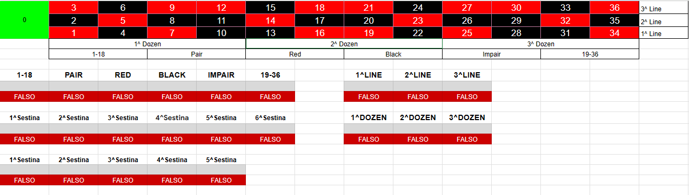
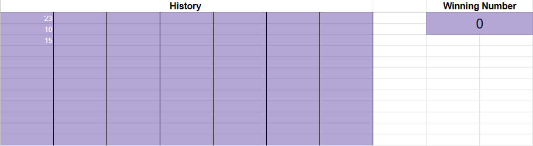
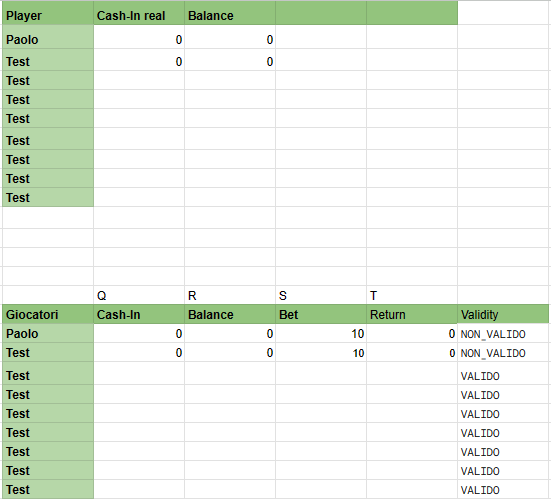

# Automated Roulette System (ARS) 🎰

ARS is a Google Sheets file that simulates a live casino and allows players to place bets on a physical roulette wheel. The file uses a set of formulas and a script to calculate bets, winnings and player balance.

## Installation

1. Go to the [ARS sheet link](insert-link-here) and make a copy of the file.
2. In the duplicate sheet, go to "Extensions" and select "Apps Script" from the drop down menu.
3. Select the 'defaultValue' function and follow the instructions to sign in to your Google account. The script will only work on your sheet and will not share data with anyone else.

## How to use

1. After running the 'defaultValue' function, all values will be set to those in the table.
2. Players can enter their bets and the dealer have to click on the "Execute" button to update the values.
3. To calculate the balances of all players, select "calculateAllBalances" from the drop-down menu and press the "Execute" button.

# Little explenation 

## Dealer sheet

### Roulette table

The Dealer will be looking at the Roulette numbers to see where the winning number is located. The cells corresponding to its characteristics will turn green and "TRUE" will be written if the number is valid.

### History and winning number
 

The dealer should enter the number that came out of the roulette wheel in the "Winning Number" column and enter it in the history of previous numbers.

### Information about players

The Dealer will keep an eye on the default values in the upper table, which must be changed according to his needs. The table below shows values such as the bet, balance and winnings for each player. These should not be changed as they are handled by formulas and scripts that work independently.

## Player sheet

### Bet, return and balance

These cells delegate the calculation of bet, win/loss and balance to formulas.

### Normal betting 

In all grey cells the player must enter the amount of money to be allocated to this bet.

### Other type of betting

As before, the player must enter the amount of money to bet in the grey cells and the correct number to bet on in the blue cells. 

## Licence

ARS is released under the terms of the GNU licence.

## Project Status

ARS is currently in beta stage and can be used without any problems. Some values in the script can be changed to customise player names, but this also involves changing references. See FAQ.

## Future goals

- Create a button to simplify the execution of the script, without having to manually change the function to be executed and without opening the Apps script.
- Create a method that decide if you have to run calculateAllBalance or load defaultValue
- Develop overlays for OBS or Streamlabs to enhance the streaming experience.

# FAQ
## Personalise the sheet 

- Can I change the names of the players?
Yes, if you have a basic knowledge of the code, you can easily change the script to suit different player names. The only thing that can be changed without loss of program references are the names in the dealer sheet.

- Can I have as many players as I want?
Of course, the important thing is to duplicate the sheets and duplicate the functions within the script by changing the references.

- Can I increase the amount of bets that can be placed?
Of course you can. However, you will need to add more cells to the original formulae  to operate on. 

## Security

- Can other players access my spreadsheet?
Yes, in read-only mode, the owner of the sheet will only give write access to certain cells and only to the player who owns the sheet.

- How do I know when a bet is invalid?
Don't worry, the script takes care of that. If you want to get to the bottom of it, a bet is considered invalid if the player exceeds his budget or bets on non-existent connections.

- What happens to invalid bets?
The bet is automatically ignored and it is as if it never happened.

## Cell colours

- Why are some cells yellow?
It means that you are also betting on the value contained in them, but to simplify the game they have been automatically filled in by a formula.

- Why are some cells blue?
It means you have to enter the numbers you want to bet on. In some cases you will only be asked for certain numbers, so make sure you know where you want to bet.

- Why are some cells grey?
It means that the amount you want to bet on those numbers will go there.

- What do "TRUE" and "FALSE" mean?
They are two values that make it easier and quicker to read, but they are actually needed for certain formulas to work correctly.

