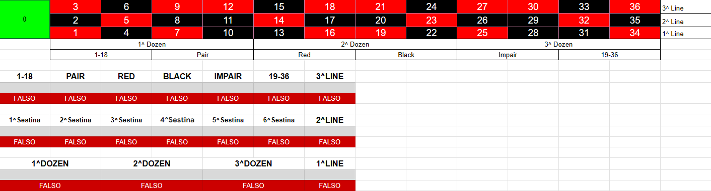
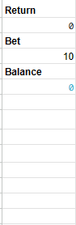

# Automated Roulette System (ARS) 🎰

The ARS project is a Google Sheets file that provides a simulation of a live casino, allowing players to place bets on a physical roulette wheel. The file uses formulas and a script to calculate players' bets, potential winnings and remaining balance. The goal of the project is to create an interactive and realistic gaming experience through the spreadsheet, allowing players to experience the thrill of gambling without having to physically travel to a casino. By using Google Sheets as the platform, the file can be easily shared with other players, allowing for virtual competition or just having fun with friends.

## Installation

1. Go to the  and make a copy of the file.
To use ARS, follow the steps below:

Click on the [ARS spreadsheet link](https://docs.google.com/spreadsheets/d/14G8uvZQG2EfwmBMk9HPM--t2D0ymGmPYAxfy_NaDtZI/edit#gid=255657849) to access the spreadsheet.
Once the sheet is open, make a copy of the file by selecting 'File' from the menu bar and selecting 'Make a copy'.
When the spreadsheet opens, you will be asked for the dealer's email address. Enter the desired email address. (If you wish to disable this option, see the wiki for further instructions).
You will see a new menu appear. Select 'Spin' from the menu and sign in to your Google Account when prompted.
The dealer will now be able to run the script directly from the menu.
What if the menu does not generate?
Sometimes Google requires authentication in order to generate the menu. If the authorisation pop-up does not appear, follow these alternative steps:

Open the 'Extensions' menu.
Select 'Apps Script'.
Run the 'onOpen' function.

## How to use

Here are the steps to follow once you have authenticated yourself and set up your merchant email:

From the "ARS" menu at the top, select "Settings".
The settings menu allows you to set the deposit amounts for each player. Enter the desired deposit amount for each player and save the settings.
Once the deposits have been set, the players can begin to place their bets. They can enter their bet amounts in the designated cells or areas.
When all players have placed their bets and are ready to proceed, the dealer should select "Spin" from the "ARS" menu.
The script will then perform the necessary calculations using a simplified B-B+R (Balance, Bet, Return) formula.
B (Balance): The script will deduct the bet amount from each player's balance.
B+ (Bet+): The script will calculate the potential winnings based on the bet amount and the roulette outcome.
R (Return): The script will update each player's balance by adding any winnings to their balance.

# Little explenation 

## Dealer sheet

### Roulette table

The Dealer will be looking at the Roulette numbers to see where the winning number is located. The cells corresponding to its characteristics will turn green and "TRUE" will be written if the number is valid.

### History and winning number + Other roulette mode
 

The dealer should enter the number that came out of the roulette wheel in the "Winning Number" column and enter it in the history of previous numbers.

### Lightning Roulette Mode
- Random number generation: The script includes a function that generates random numbers up to 60. However, if a generated number is greater than 36, it is cancelled or ignored. This ensures that only numbers within the valid range for roulette (1-36) are considered.
- Multipliers: Multipliers for numbers are randomly selected from an array. The array consists of 16 numbers and the selection is done randomly; however, there are repetitions for more likely to have lower multipliers.

### Hybrid number (ex. Double Spin Mode)
- The hybrid number, formerly called hybrid double spin mode, is a reference to the use of a digital roulette wheel. This number is not part of the formulas, but it is present and ready to be implemented, since all you have to do is change the formulas and adapt them to your needs. 

### Information about players

The table on the Dealer's sheet serves as a valuable tool for managing players' bets and winnings in ARS. Let's explore its columns and their functions:

- Column Q (Cash In): This column represents the initial "Cash In" amount for each player. It records the initial amount that each player has available for betting.
  
- Column R (Balance): The Balance column tracks each player's remaining balance after bets have been placed and winnings have been paid. The balance is automatically updated based on bets and winnings.
  
- Column S (Bet): In this column, the dealer can enter the bets made by the players. Each player's bet amount can be recorded in the corresponding cell of column S.
  
- Column T (Win): The "Win" column shows each player's winnings. When a player wins a bet, the winning amount is recorded in this column. This allows for a clear and organized tracking of each player's winnings.
  
- Last Column (Validity): This column determines whether a player's bet is "VALID" or "NON_VALID". It is used to check if a bet exceeds the player's available budget. If the bet exceeds the budget, it will be marked "NON_VALID" to prevent players from placing bets that exceed their allotted budget.

## Player sheet

### Bet, return and balance

These cells are simply repetitions but serving the player not to constantly change folio. 

### Simple betting 

In all grey cells the player must enter the amount of money to be allocated to this bet.

### Other type of betting

As before, the player must enter the amount of money to bet in the grey cells and the correct number to bet on in the blue cells. 

## Licence

ARS is released under the terms of the GNU licence.

## Project Status

ARS is still in beta, it is currently at version 0.9, this means that version 1.0.0 will be released, which will be the first final version with no bugs and no upcoming official changes to the code. I will not spend much time on this project anymore, there may be new features, but I want the community to take care of it. What will be developed is the "Extra" branch, which will star in hosting the code for the official website, which will only be a demo gambling site and will not take over the real gambling world for now. It will also be a reference site for new players as it will host a blog section.

# FAQ --> THIS SECTION IS MOVED INTO THE WIKI

